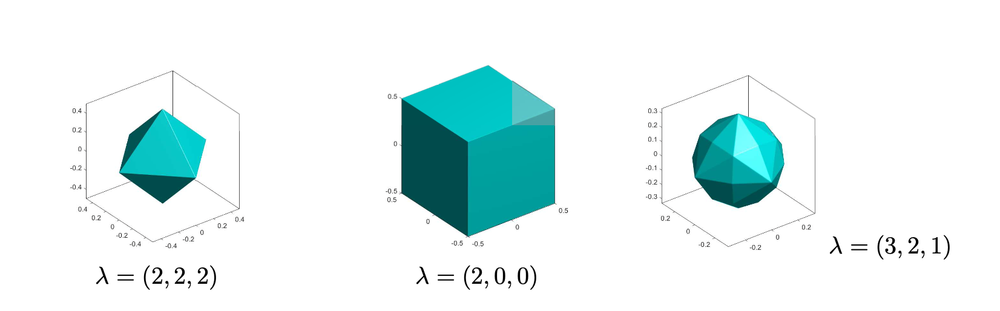
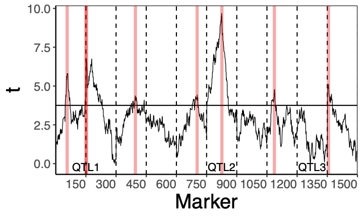
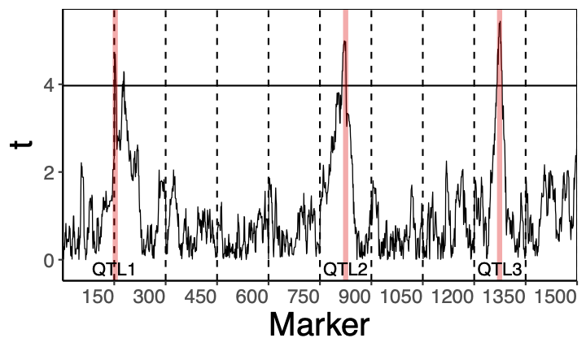

## PhD position 
We are annoncing a fully founded PhD position witihn a project for model selection for high dimensional data, with application towards genetics, at Lund University.
The two main coordinater of the project are [Matgorzata Bogdan](https://www.researchgate.net/profile/Matgorzata_Bogdan) and [Jonas Wallin](https://www.researchgate.net/profile/Jonas_Wallin).

We are looking for a student that fits in one of following two tracks witinh statistics:
#### biostatics track
Here the students has a
  *  MSc in mathematics of statistics
  *  Strong mathematical skills (probability, functional analysis, linear algebra)
  *  Some experince in programming 

#### mathematical track
Here the students has a
  * MSc in mathematics, statistics, computer science, biostatistics or physics
  * Sound knowledge of applied statistics (linear models, Bayesian statistics) 
  * Strong programing skills (R and/or C++ )
  * Ability to work  in an interdisciplinary team at the interface of genetics, computer science and statistics.

## Project description: 
In previous projects (see [1], [2]) we developed SLOPE, the convex model selection and estimation method for high-dimensional statistical problems. Various versions of the "SLOPE ball" can be seen in the figure on the top of the page.  Recently, we also developed an Adaptive Bayes version of SLOPE (ABSLOPE) [3], which allows for incorporation of the prior knowledge and can handle latent variables, like the missing data. Despite of several important articles pointing at desired properties of  SLOPE (see[4],[5],[6]), the mathematical theory of SLOPE is still undeveloped. The PhD candidate who selects the mathematical statistics path of the project will be involved in the development of new mathematical results concerning asymptotic properties of SLOPE and ABSLOPE, including asymptotic control of the false discovery rate or investigation of the prediction accuracy.
The applied part of the project will be mainly concerned with gene identification. In our recent article [7] we have shown that oversimplified statistical models may lead to the detection of many false discoveries.  We have also illustrated that this problem can be solved by adding a random effect, describing the polygenic background. The difference between the two method is shown at the bottom of the page where the left figure is the classical method and the right figures is our method. In the present project we plan to extend this approach to handle the variability of the polygenic background along the chromosome. The estimation problem will be addressed by developing the appropriate version of ABSLOPE. This will require also speeding up the ABSLOPE algorithm. The PhD student who selects the applied path will be involved in the research on speeding the algorithm (see e.g. [8]) and/or developing methodology for gene identification.

References:
1. [M. Bogdan, E. van den Berg, C. Sabatti, W. Su, and E. J. Candes. SLOPE – adaptive variable selection via convex optimization. Annals of Applied Statistics, 9(3):1103–1140, 2015.](https://projecteuclid.org/journals/annals-of-applied-statistics/volume-9/issue-3/SLOPEAdaptive-variable-selection-via-convex-optimization/10.1214/15-AOAS842.full)
2. [D. Brzyski, A. Gossmann, W. Su, and M. Bogdan. Group SLOPE - adaptive selection of groups of predictors. Journal of the American Statistical Association, 114:419–433, 2019.](https://arxiv.org/abs/1511.09078)
3. [W. Jiang, M. Bogdan, J. Josse, B. Miasojedow, V. Rockova, TB Group. Adaptive Bayesian SLOPE--High-dimensional Model Selection with Missing Values, arXiv:1909.06631, 2019.](https://arxiv.org/abs/1909.06631)
4. [W. Su and E.J. Candes. SLOPE is adaptive to unknown sparsity and asymptotically minimax. Annals of Statistics, 40:1038–1068, 2016.](https://projecteuclid.org/journals/annals-of-statistics/volume-44/issue-3/SLOPE-is-adaptive-to-unknown-sparsity-and-asymptotically-minimax/10.1214/15-AOS1397.full)
5. [P.C. Bellec, G. Lecu´e, and A.B. Tsybakov. Slope meets lasso: Improved oracle bounds and optimality. Annals of Statistics, 46(6B):3603–3642, 2018.](https://arxiv.org/abs/1605.08651)
6. [F. Abramovich and V. Grinshtein. High-dimensional classification by sparse logistic regression. IEEE Transactions on Information Theory, 65:3068–3079, 2019.](https://arxiv.org/abs/1706.08344)
7. [J. Wallin, M. Bogdan, P. A. Szulc, R.W. Doerge, and D.O. Siegmund. Ghost QTL and Hotspots in experimental crosses— novel approach for modeling polygenic effects. Genetics, 2021. doi:10.1093/genetics/iyaa041.](https://academic.oup.com/genetics/advance-article/doi/10.1093/genetics/iyaa041/6067404)
8. [J. Larsson, M. Bogdan, and J. Wallin. The strong screening rule for SLOPE. Advances in Neural Information Processing Systems 33 preproceedings (NeurIPS 2020), 2020.](https://papers.nips.cc/paper/2020/file/a7d8ae4569120b5bec12e7b6e9648b86-Paper.pdf)

  
